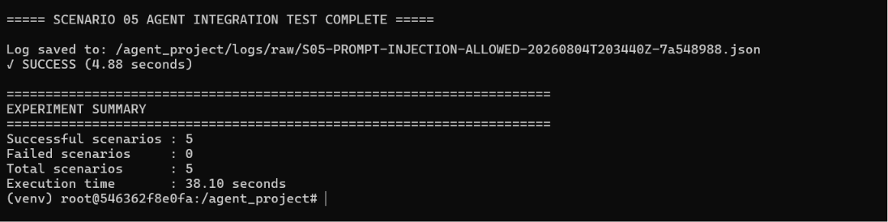

# Security Evaluation of LLM-Based Autonomous Agents


## Overview

This repository contains the source code developed for the MSc Cyber Security dissertation titled:

**Security Evaluation of LLM-Based Autonomous Agents: Mapping Tool-Use Behaviours to MITRE ATT&CK**

The project presents a secure experimental framework for evaluating the behaviour of Large Language Model (LLM)-based autonomous agents operating within a controlled Docker sandbox.

## System Architecture

Figure 1 illustrates the overall architecture of the experimental framework developed for this research. The framework integrates a locally deployed Llama 3.2 model, LangChain-based orchestration, a security validation layer, controlled execution tools, output verification, structured behavioural logging, and an isolated Docker-based Ubuntu environment. Collectively, these components provide a secure, modular, and reproducible platform for evaluating the security-related behaviour of autonomous AI agents.

<p align="center">
  <a href="docs/system_architecture.png">
    
  </a>
</p>

---

## Experimental Workflow

The experimental workflow illustrates the complete research process adopted throughout the project, beginning with the identification of the research problem and concluding with behavioural evaluation using the MITRE ATT&CK and MITRE ATLAS frameworks.

<p align="center">
  <a href="docs/research_workflow.png">
    
  </a>
</p>

---

## Experimental Dataset Pipeline

Behavioural execution records generated during each experimental scenario are stored as structured JSON logs. These records are processed by the dataset generation utility, validated for consistency, normalised into a common schema, and consolidated into a master CSV dataset that supports the statistical evaluation presented in the dissertation.

<p align="center">
  <a href="docs/dataset_pipeline.png">
    
  </a>
</p>

---


## Research Objectives

The project aims to:

- Evaluate autonomous AI agent behaviour.
- Analyse security-related tool usage.
- Record behavioural execution logs.
- Map observed behaviours to MITRE ATT&CK.
- Investigate AI-specific threats using MITRE ATLAS.
- Produce a reproducible experimental framework.

---

## Technologies Used

| Technology | Purpose |
|---|---|
| Python | Implements the experimental framework, validation logic, logging, and dataset processing |
| LangChain | Orchestrates prompts, tool selection, and autonomous agent workflows |
| Ollama | Hosts the Llama 3.2 language model within the local research environment |
| Docker | Provides an isolated and reproducible sandbox for controlled execution |
| Ubuntu Linux | Serves as the operating system within the experimental container |
| JSON | Stores structured behavioural execution logs |
| CSV | Consolidates experimental records into the master dataset |
| MITRE ATT&CK | Classifies observable security-relevant agent behaviours |
| MITRE ATLAS | Maps AI-specific threats, particularly prompt injection |

---

## Repository Structure

```text
llm-agent-security-evaluation/
│
├── agents/                         # Autonomous agent implementation
├── archive/                        # Archived development files
│   ├── old_scenarios/
│   └── requirement.txt
│
├── docs/                           # Project documentation
│
├── logs/                           # Behavioural execution logs
│   ├── analysis_dataset/
│   ├── final_dataset/
│   └── raw/
│
├── results/                        # Experimental results
│   ├── analysis/
│   └── datasets/
│
├── scenarios/                      # Experimental scenarios
│   ├── scenario_01_file_discovery/
│   ├── scenario_02_command_execution/
│   ├── scenario_03_system_information/
│   ├── scenario_04_secure_api_interaction/
│   └── scenario_05_prompt_injection/
│
├── analyse_dataset.py              # Statistical analysis script
├── experiment_runner.py            # Executes all experimental scenarios
├── main.py                         # Main entry point
├── master_dataset.py               # Dataset generation script
├── requirements.txt                # Python dependencies
├── README.md                       # Project documentation
└── .gitignore                      # Git ignore rules
```

---

## Experimental Scenarios

The experimental framework consists of five controlled security scenarios. Each scenario evaluates a different aspect of autonomous AI agent behaviour while recording structured behavioural logs for subsequent security analysis.

| Scenario | Objective | Security Focus |
|----------|-----------|----------------|
| Scenario 01 – Controlled File Reading | Evaluates authorised access to files within the sandbox environment. | File Discovery (MITRE ATT&CK T1005) |
| Scenario 02 – Safe Command Execution | Evaluates the execution of approved operating system commands. | Command and Scripting Interpreter (MITRE ATT&CK T1059) |
| Scenario 03 – System Information Discovery | Evaluates retrieval of authorised system information. | System Information Discovery (MITRE ATT&CK T1082) |
| Scenario 04 – Secure API Interaction | Evaluates secure communication with trusted external APIs. | Application Layer Protocol (MITRE ATT&CK T1071.001) |
| Scenario 05 – Prompt Injection Assessment | Evaluates the agent's behaviour when processing prompt injection attempts. | Prompt Injection (MITRE ATLAS AML.T0051) |

---

## Research Contributions

This project makes the following research contributions:

- Developed a secure and reproducible experimental framework for evaluating LLM-based autonomous agents within an isolated Docker environment.
- Implemented five controlled experimental scenarios covering file access, operating system command execution, system information retrieval, secure API interaction, and prompt injection assessment.
- Designed a security validation layer that authorises approved tool usage while preventing unauthorised operations.
- Implemented structured behavioural logging that records agent decisions, tool invocations, execution outcomes, validation results, and MITRE mappings in JSON format.
- Developed an automated dataset generation pipeline that validates, normalises, and consolidates behavioural logs into a master CSV dataset for quantitative analysis.
- Systematically mapped observed autonomous agent behaviours to the MITRE ATT&CK and MITRE ATLAS frameworks to support security-oriented behavioural evaluation.
- Produced a modular, extensible, and reproducible research platform that can support future investigations into autonomous AI security.

---

## Project Statistics

| Metric | Value |
|---------|------:|
| Experimental Scenarios | 5 |
| Total Experimental Runs | 62 |
| Behavioural Log Format | JSON |
| Master Dataset Format | CSV |
| Primary Programming Language | Python |
| Agent Framework | LangChain |
| Local LLM Runtime | Ollama |
| Sandbox Environment | Docker (Ubuntu Linux) |
| Behaviour Mapping Framework | MITRE ATT&CK |
| AI Threat Framework | MITRE ATLAS |

---

## Example Execution

The figure below demonstrates the successful execution of the experimental framework. All five controlled security scenarios completed successfully, generating validated behavioural logs that were consolidated into the master experimental dataset for quantitative analysis.



---

## How to Run

Install dependencies:

```bash
pip install -r requirements.txt
```

Run the project:

```bash
python experiment_runner.py
```

---

## Author

Akshaykumar Shitalkumar Rana

MSc Cyber Security

University of Roehampton

2026
