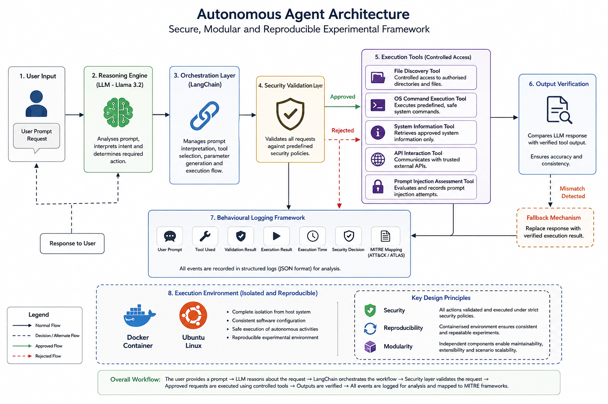
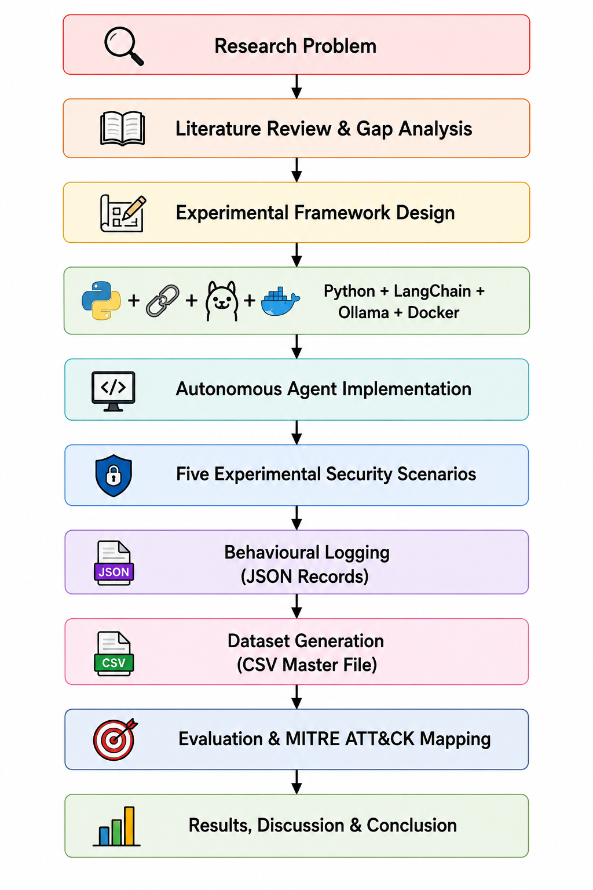
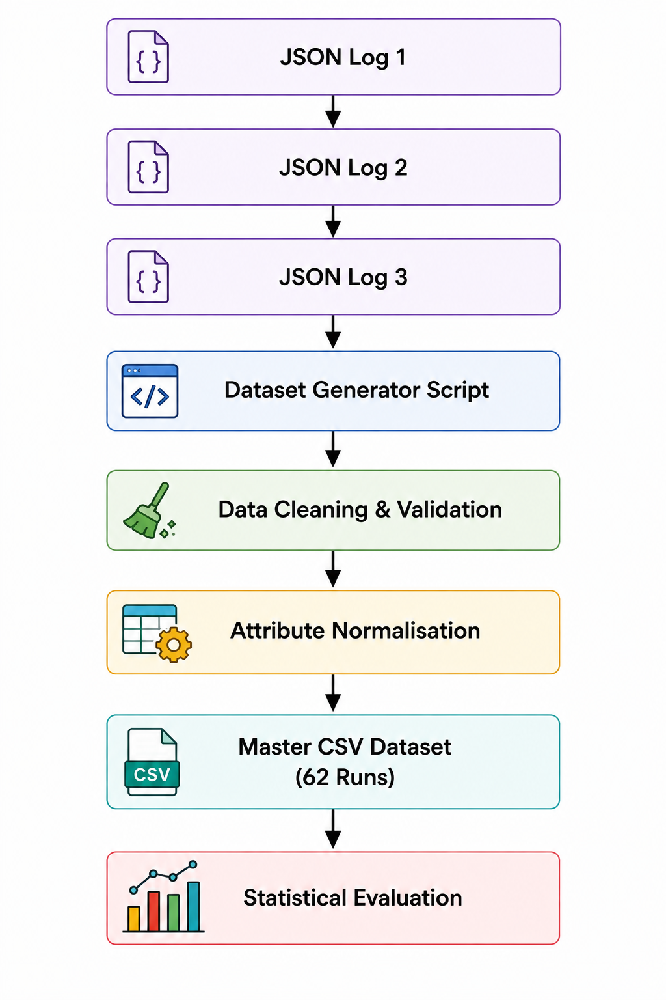

# Security Evaluation of LLM-Based Autonomous Agents

## Overview

This repository contains the source code developed for the MSc Cyber Security dissertation titled:

**Security Evaluation of LLM-Based Autonomous Agents: Mapping Tool-Use Behaviours to MITRE ATT&CK**

The project presents a secure experimental framework for evaluating the behaviour of Large Language Model (LLM)-based autonomous agents operating within a controlled Docker sandbox.

## System Architecture

Figure 1 illustrates the overall architecture of the experimental framework developed for this research. The framework integrates a locally deployed Llama 3.2 model, LangChain-based orchestration, a security validation layer, controlled execution tools, output verification, structured behavioural logging, and an isolated Docker-based Ubuntu environment. Collectively, these components provide a secure, modular, and reproducible platform for evaluating the security-related behaviour of autonomous AI agents.



---

## Experimental Workflow

The experimental workflow illustrates the complete research process adopted throughout the project, beginning with the identification of the research problem and concluding with behavioural evaluation using the MITRE ATT&CK and MITRE ATLAS frameworks.



---

## Experimental Dataset Pipeline

Behavioural execution records generated during each experimental scenario are stored as structured JSON logs. These records are processed by the dataset generation utility, validated for consistency, normalised into a common schema, and consolidated into a master CSV dataset that supports the statistical evaluation presented in the dissertation.



---


## Research Objectives

The project aims to:

- Evaluate autonomous AI agent behaviour.
- Analyse security-related tool usage.
- Record behavioural execution logs.
- Map observed behaviours to MITRE ATT&CK.
- Investigate AI-specific threats using MITRE ATLAS.
- Produce a reproducible experimental framework.

---

## Technologies Used

- Python
- LangChain
- Ollama
- Docker
- Ubuntu Linux
- JSON
- MITRE ATT&CK
- MITRE ATLAS

---

## Repository Structure

```text
llm-agent-security-evaluation/
│
├── agents/                         # Autonomous agent implementation
├── archive/                        # Archived development files
│   ├── old_scenarios/
│   └── requirement.txt
│
├── docs/                           # Project documentation
│
├── logs/                           # Behavioural execution logs
│   ├── analysis_dataset/
│   ├── final_dataset/
│   └── raw/
│
├── results/                        # Experimental results
│   ├── analysis/
│   └── datasets/
│
├── scenarios/                      # Experimental scenarios
│   ├── scenario_01_file_discovery/
│   ├── scenario_02_command_execution/
│   ├── scenario_03_system_information/
│   ├── scenario_04_secure_api_interaction/
│   └── scenario_05_prompt_injection/
│
├── analyse_dataset.py              # Statistical analysis script
├── experiment_runner.py            # Executes all experimental scenarios
├── main.py                         # Main entry point
├── master_dataset.py               # Dataset generation script
├── requirements.txt                # Python dependencies
├── README.md                       # Project documentation
└── .gitignore                      # Git ignore rules
```

---

## Experimental Scenarios

- Scenario 01 – File Discovery
- Scenario 02 – Command Execution
- Scenario 03 – System Information Discovery
- Scenario 04 – Secure API Interaction
- Scenario 05 – Prompt Injection

---

## How to Run

Install dependencies:

```bash
pip install -r requirements.txt
```

Run the project:

```bash
python experiment_runner.py
```

---

## Author

Akshaykumar Shitalkumar Rana

MSc Cyber Security

University of Roehampton

2026
